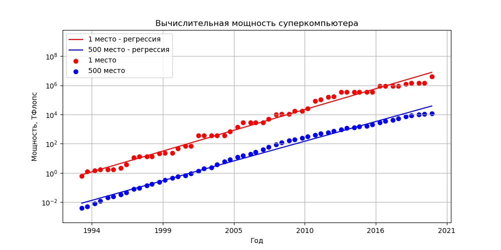
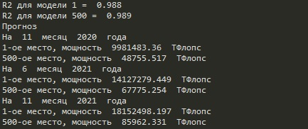

# Домашнее задание №1
1. Написать эссе (1-2 страницы) по применениям суперкомпьютеров в науке, индустрии и бизнесе. Можно выбрать интересный пример из интернета и описать. Опишите также как, на ваш взгляд, применение суперкомпьютеров и параллельных вычислений пригодится вам в карьере.
2. Используя данные с сайта top500.org (statistics/performance development) попробуйте предсказать вычислительную мощность компьютера #1 и компьютера #500. (численное значение - 50 процентов от задания, численное значение + график - 100 процентов от задания)

Название файла  | Содержание файла
----------------|----------------------
esse.pdf        | Эссе
source.py       | Исполняемый скрипт
1.csv           | Данные по 1-ому месту
500.csv         | Данные по 500-ому месту
Мощность.jpg    | График зависимости мощности от времени
Прогноз.jpg     | Результаты прогноза

## Задание 1
Суперкомпьютеры используются во всех сферах, где для решения задачи применяется численное моделирование; там, где требуется огромный объём сложных вычислений, обработка большого количества данных в реальном времени, или решение задачи может быть найдено простым перебором множества значений множества исходных параметров.

Используя суперкомпьютер в разработке новой продукции, можно заранее предвидеть многие скрытые инженерные проблемы и довести продукт до рынка быстрее, чем это делалось раньше, когда в работоспособности нового изделия нужно было убеждаться на опыте. НРС-ресурсы позволяют промышленности выпускать на рынок новую продукцию, затрачивая на её разработку меньше времени. 

HPC технологии стали активно использоваться в авиационной промышленности для разработки перспективных самолётов и авиалайнеров, автомобильной промышленности для прочностных динамических расчётов столкновения автомобилей (с целью уменьшения натурных испытаний). Высокопроизводительные вычисления позволяют проводить проектирование и исследование процессов на высоко полигональных моделях в реальном времени, позволяют использовать виртуальную реальность для отработки гипотез. 

HPC помогают проводить расчёты при поиске и разработке месторождений, при прогнозировании погодных явлений и обработки информации в больших объёмах.

Применение суперкомпьютеров в научных сферах позволит приблизиться к моделированию систем на атомарном уровне. Любые достижения в области нанотехнологий недоступны без вычислительной мощности суперкомпьютеров, просто потому что многие процессы нельзя замерить, их можно только смоделировать в виртуальном пространстве.

## Задание 2

Рисунок 1 - Зависимость мощности от времени

Рисунок 2 - Прогнозные значения
